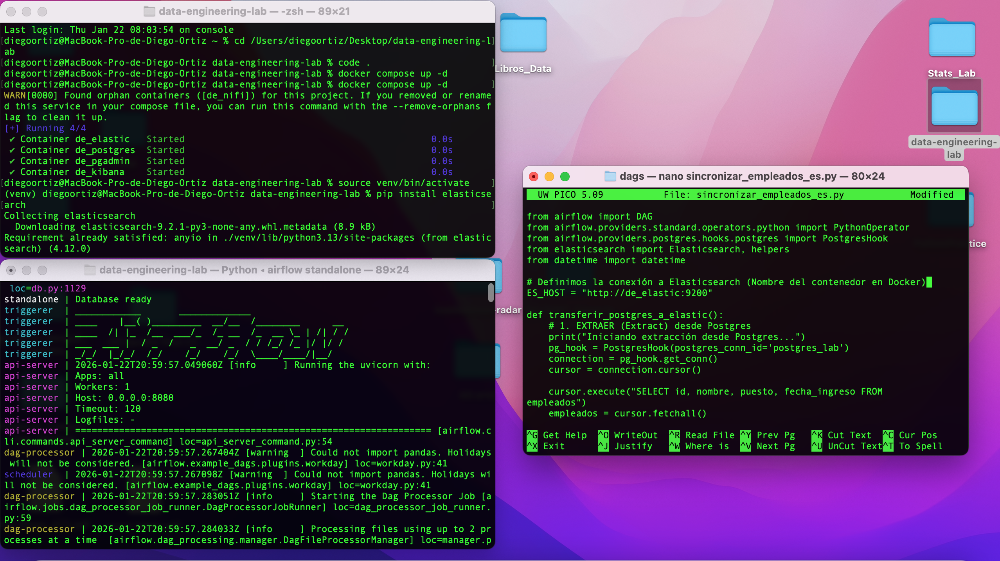

# Data Engineering Lab: End-to-End ETL with Airflow & Docker 


Este repositorio contiene una implementación práctica de **Data Pipelines** orquestados con **Apache Airflow** y contenerizados con **Docker**. El proyecto simula un 
entorno empresarial de ingeniería de datos, desde la generación de datos sintéticos hasta la extracción de reportes de negocio.



##  Arquitectura del Proyecto

El sistema utiliza una arquitectura contenerizada donde **Airflow** actúa como el cerebro orquestador que conecta servicios aislados a través de una red Docker interna.

El stack tecnológico está diseñado para ser modular y escalable:

* **Orquestación:** Apache Airflow 2.x (Python Operators, Postgres Hooks).
* **Contenerización:** Docker & Docker Compose.
* **Base de Datos:** PostgreSQL 13.
* **Lenguaje:** Python 3.x.
* **Librerías Clave:** `Faker` (Data Generation), `Pandas`.

## ️ Pipelines Automatizados (DAGs)

1.  **`crear_tabla_empleados`**:
    * Inicialización DDL (Data Definition Language).
    * Crea esquemas y tablas relacionales en PostgreSQL de forma idempotente.

2.  **`contratar_personal_masivo`**:
    * **Extracción:** Generación de Mock Data con la librería `Faker`.
    * **Transformación:** Limpieza de strings y validación de tipos de datos (Python).
    * **Carga:** Inserción masiva optimizada (`executemany`) en PostgreSQL.

3.  **`exportar_empleados_csv`**:
    * Proceso de **Reverse ETL**.
    * Extrae datos procesados del Data Warehouse y genera reportes planos (.csv) para consumo de los stakeholders.

4.  **`sincronizar_empleados_es.py`**:
    * Pipeline Híbrido.
    * El pipeline no solo mueve datos; cruza fronteras entre tecnologías (SQL relacional a NoSQL documental) y entre entornos (mi Mac local a un contenedor Docker).

### **Pipelines Sistema Dual**

5. **`Hybrid Data Pipeline (SQL -> NoSQL) con Time-Travel`**:
 
**Orquestación:** DAG configurado con catchup=True para ejecutar Backfilling automático. Capaz de recuperar y procesar semanas de datos históricos de contrataciones en 
segundos.

**Flujo:** Extrae datos transaccionales de PostgreSQL y los inyecta masivamente (helpers.bulk) en Elasticsearch para habilitar búsquedas ultrarrápidas.

6. **`E-commerce Clickstream Simulator`**:
 
**Streaming de Eventos:** Generación de miles de eventos de navegación de usuarios (page_view, add_to_cart, purchase).

**Real-Time Analytics:** Inyección directa a Elasticsearch saltando la base de datos relacional, permitiendo monitoreo en vivo del comportamiento del usuario en Kibana.

### **Arquitectura del Sistema Dual**

## El orquestador maneja dos pipelines principales de forma simultánea.

    A -->|Batch Insert| B
    B -->|PostgresHook Extraction| C
    E -->|Real-Time Event Stream| C
    C -->|Bulk API (JSON)| D
    D -->|Index Search| F


## Visualización de Datos
El proyecto continua en Kibana, aprovechando los índices generados (empleados_search y ecommerce_clickstream) para construir Dashboards interactivos que permiten cruzar datos 
demográficos y de comportamiento web al instante.


##  Cómo ejecutar este proyecto

1.  **Levantar Infraestructura:**
    ```bash
    docker compose up -d
    ```

2.  **Configurar Entorno Python:**
    ```bash
    python3 -m venv venv
    source venv/bin/activate
    pip install apache-airflow faker apache-airflow-providers-postgres
    ```

3.  **Iniciar Airflow:**
    ```bash
    export AIRFLOW_HOME=~/airflow
    airflow standalone
    ```

##  Autor
**Diego Ortiz** - *Data Engineer*
